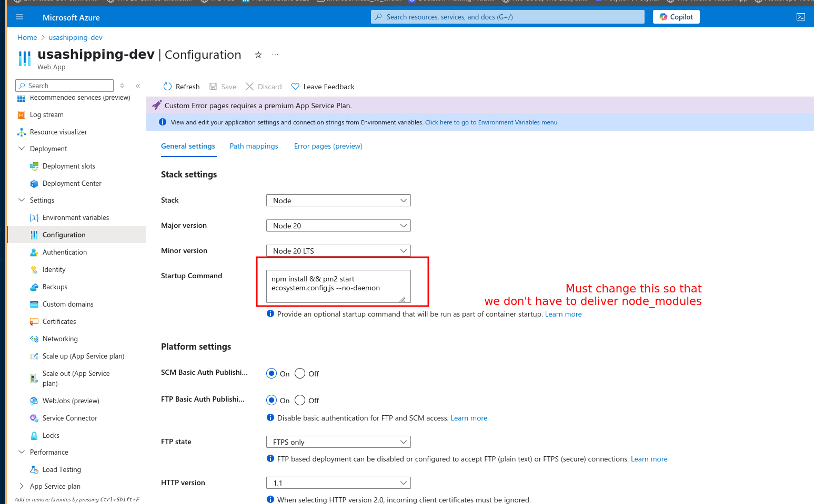
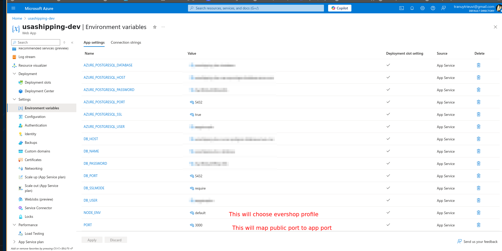
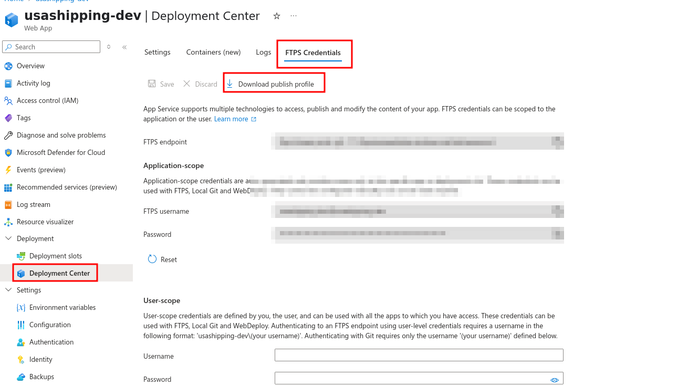
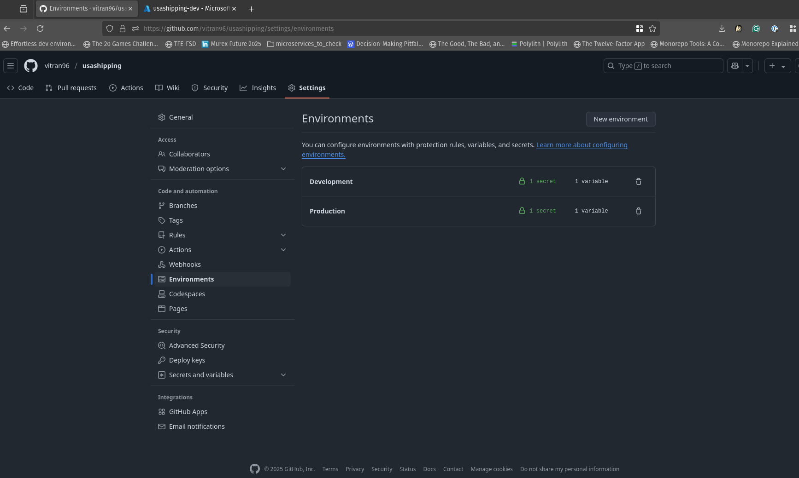
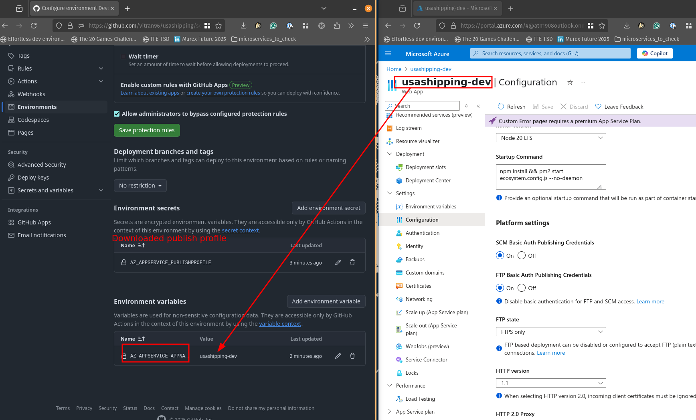

# How to deploy on AZ App service

## Follow evershop tutorial

[Evershop AZ App service deployment](https://evershop.io/docs/development/deployment/deploy-evershop-to-azure)

## Create DB

If App service don't create DB for you, you can create it manually.

## Reconfigure App service startup command

Go to Settings > Configuration



## Adding App service environment variables

Go to Settings > Environment variables

Add environment variables from template below.
If there is any missing environment variables from evershop tutorial, please add them.

```json
[
  {
    "name": "DB_HOST",
    "value": "",
    "slotSetting": true
  },
  {
    "name": "DB_NAME",
    "value": "",
    "slotSetting": true
  },
  {
    "name": "DB_USER",
    "value": "",
    "slotSetting": true
  },
  {
    "name": "DB_PASSWORD",
    "value": "",
    "slotSetting": true
  },
  {
    "name": "DB_PORT",
    "value": "",
    "slotSetting": true
  },
  {
    "name": "DB_SSLMODE",
    "value": "require",
    "slotSetting": true
  },
  {
    "name": "NODE_ENV",
    "value": "default",
    "slotSetting": true
  },
  {
    "name": "PORT",
    "value": "3000",
    "slotSetting": true
  },
  {
    "name": "URL",
    "value": "",
    "slotSetting": true
  }
]
```



## Download App service publish profile



## GitHub workflow

If AZ App service didn't create, follow the template below to create a workflow file in `.github/workflows/` folder.

**NOTE**: this workflow will not packing the `node_modules` folder, so if you want to deploy a production version, you need to run `npm ci` before deploying.

```yaml
# Docs for the Azure Web Apps Deploy action: https://github.com/Azure/webapps-deploy
# More GitHub Actions for Azure: https://github.com/Azure/actions

name: AZ App service - Build & Deploy

on:
  push:
    branches:
      - dev
      - main
  workflow_dispatch:

jobs:
  build:
    runs-on: ubuntu-latest
    permissions:
      contents: read #This is required for actions/checkout

    steps:
      - uses: actions/checkout@v4

      - name: Set up Node.js version
        uses: actions/setup-node@v3
        with:
          node-version: "20.x"

      - name: npm install, build, and test
        run: |
          npm install
          npm run build --if-present
          npm run test --if-present

      - name: Zip artifact for deployment
        run: zip release.zip . -r -x 'node_modules/*' 'release.zip' '.github/*' '.git/*' '.gitignore' 'README.md' '.env'

      - name: Upload artifact for deployment job
        uses: actions/upload-artifact@v4
        with:
          name: node-app
          path: release.zip

  deploy:
    runs-on: ubuntu-latest
    needs: build
    environment:
      name: |-
        ${{ 
          github.ref_name == 'main' && 'Production'
          || 'Development'
        }}
      url: ${{ steps.deploy-to-webapp.outputs.webapp-url }}

    steps:
      - name: Download artifact from build job
        uses: actions/download-artifact@v4
        with:
          name: node-app

      - name: Unzip artifact for deployment
        run: unzip release.zip

      - name: "Deploy to Azure Web App"
        id: deploy-to-webapp
        uses: azure/webapps-deploy@v3
        with:
          app-name: ${{ vars.AZ_APPSERVICE_APPNAME}}
          slot-name: "Production"
          package: .
          publish-profile: ${{ secrets.AZ_APPSERVICE_PUBLISHPROFILE }}
```

## GitHub environment secrets & variables

To use template above and allow auto switch between dev and prod deployment secrets and variables, you need to create a GitHub environment for each environment.

We need:
- Secrets:
  - AZ_APPSERVICE_PUBLISHPROFILE
- Variables:
  - AZ_APPSERVICE_APPNAME

1. Go to your repository environments & create / edit environment

1. Create / edit secrets & variables
